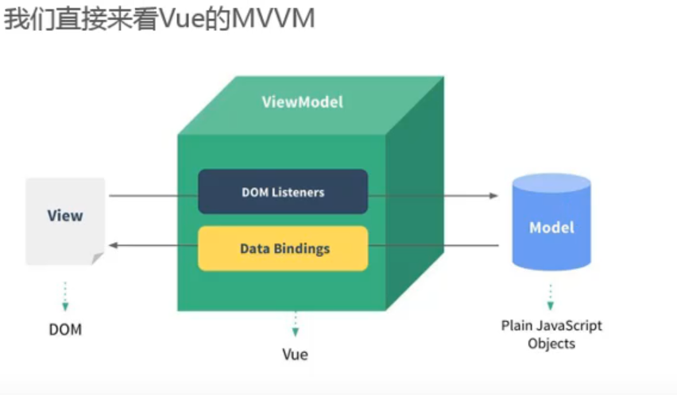
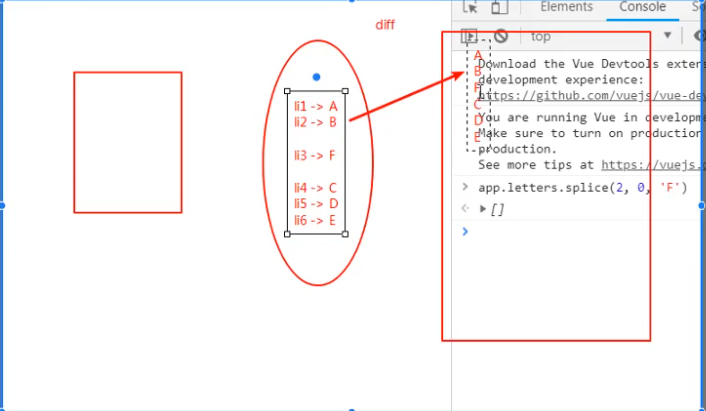
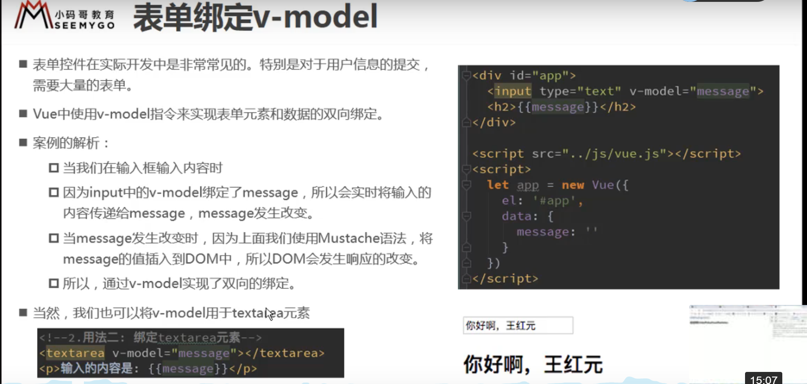
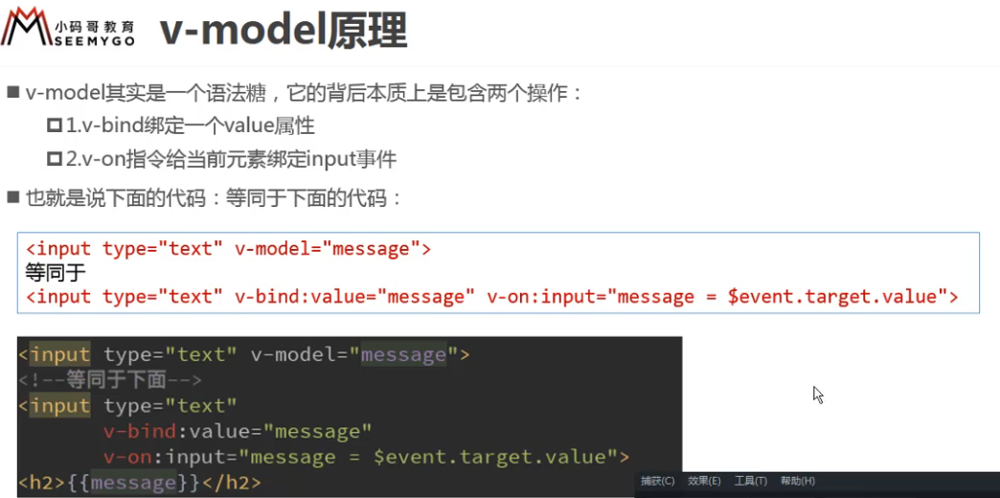
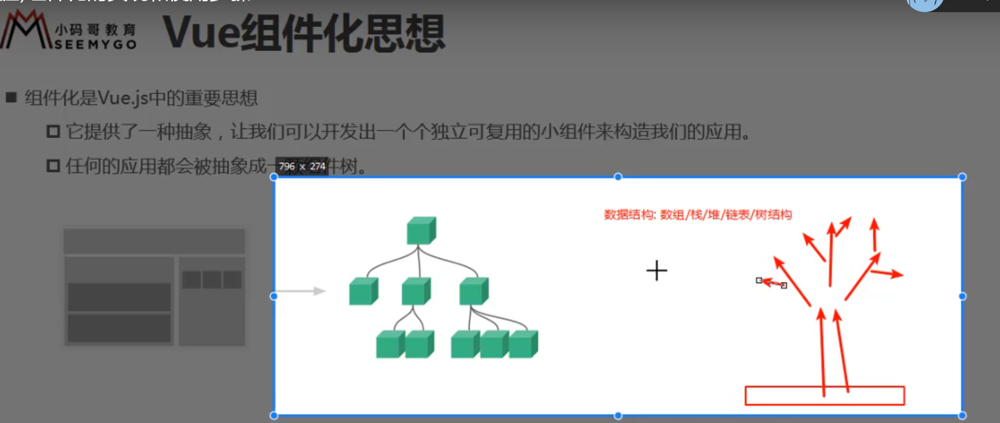
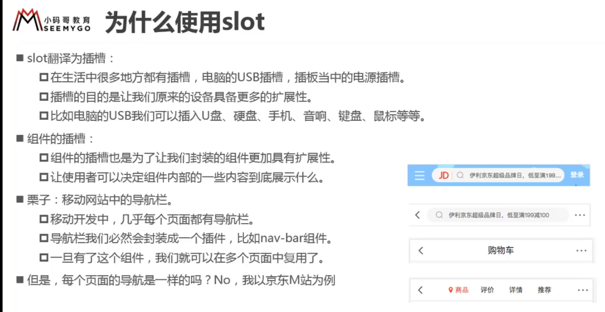

# 关于Vue的笔记（针对本人的理解点和重难点）  

vue的数据绑定跟微信小程序有点像  
指令带有前缀 v-  
如：v-if v-for

## MVVM 

Model数据绑定到View,x响应式，将Model的改变实时反应到Vi额外中  
DOM监听，发生事件改变对应的Data

## 虚拟DOM
案例为: [06登录案例](main/06-条件判断/04用户切换登录的案例.html)  
  
用key=" "作标识

## v-show  

## 组件key的属性
  
key一定要是**唯一性**的，不然没太大意义，不要绑定index,比如在插入的时候index会改变
比如在列表中插入一个元素  
[for添加key](main/07-循环遍历/03v-for添加key.html)

## v-model原理
  

## v-model修饰符

## 组件化

vue的组件化  

注册组件步骤
  

### 组件的data必须是函数

### 父子组件间的通信  
**注意：Vue实例本身可以看作一个组件，并且是root组件，即顶层父组件**  
  
#### 父传子  
props可以是数组或者对象
组件props数据验证
  
#### 子传父  
  
  

### 父子组件的访问  

### 插槽slot
  
  
编译作用域

