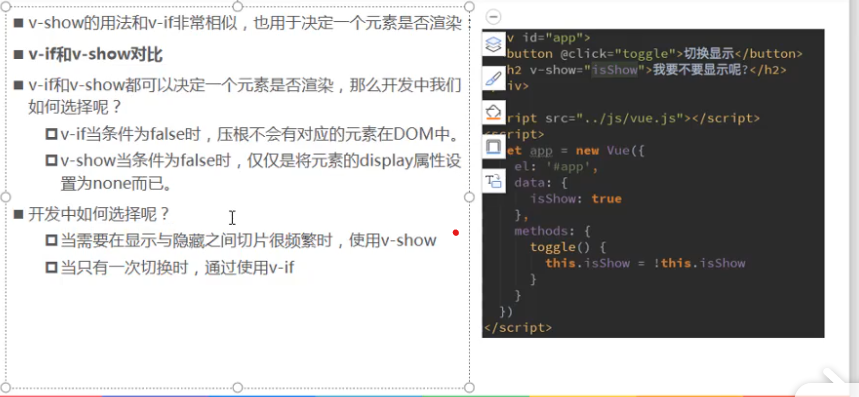
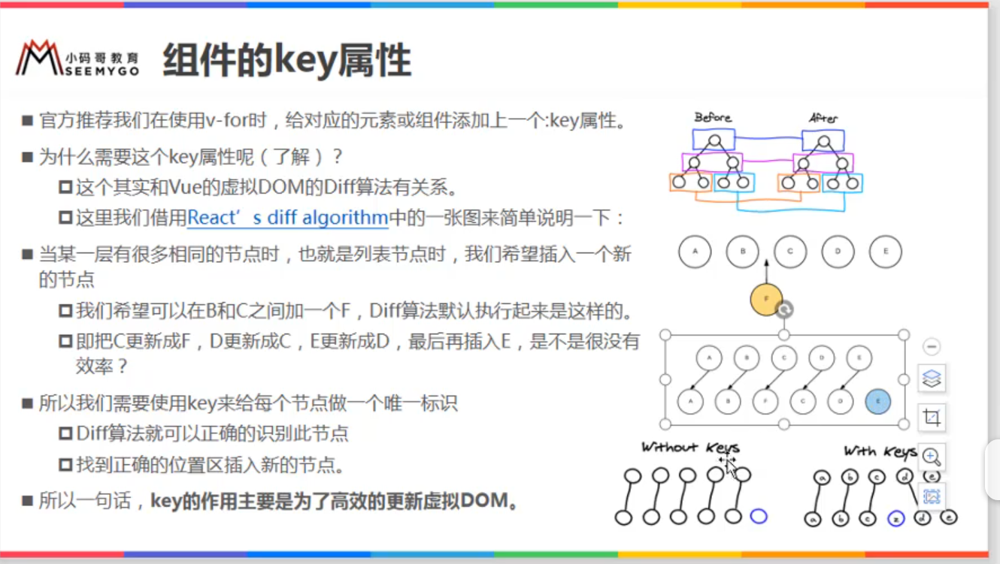

# 关于Vue的笔记（针对本人的理解点和重难点）  

vue的数据绑定跟微信小程序有点像  
指令带有前缀 v-  
如：v-if v-for

## MVVM 

Model数据绑定到View,x响应式，将Model的改变实时反应到Vi额外中  
DOM监听，发生事件改变对应的Data

## 虚拟DOM
案例为: [06登录案例](main/06-条件判断/04用户切换登录的案例.html)  
  
用key=" "作标识

## v-show  

## 组件key的属性
  
key一定要是**唯一性**的，不然没太大意义，不要绑定index,比如在插入的时候index会改变
比如在列表中插入一个元素  
[for添加key](main/07-循环遍历/03v-for添加key.html)
